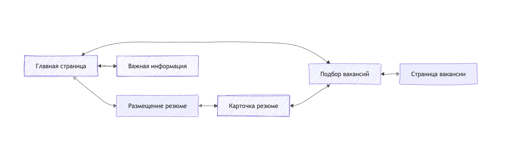
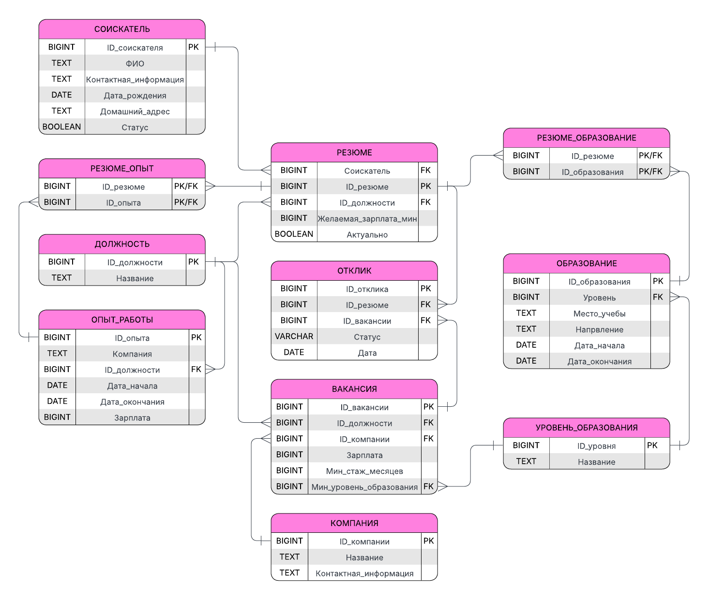

# Отчёт по этапу 1
## «Кадровое агентство: вакансии и резюме» (вариант 7)

**Репозиторий:** https://github.com/AstVic/javaprak_var7  
**СУБД:** MySQL  
**Сборка:** Apache Ant

---

## 1. Назначение системы

Разрабатываемое web-приложение предназначено для автоматизации работы кадрового агентства. Система позволяет хранить и обрабатывать информацию о соискателях, их резюме, компаниях и вакансиях.

**Основные возможности:**
- размещение и редактирование резюме;
- просмотр актуальных вакансий;
- подбор вакансий под резюме и резюме под вакансии;
- фиксация откликов соискателей на вакансии.

В основе приложения лежит реляционная база данных со следующими сущностями:
- Соискатель
- Резюме
- Образование
- Опыт_работы
- Компания
- Вакансия
- Отклик
- справочники: Уровень_образования, Должность

Связи между сущностями реализованы через внешние ключи и промежуточные таблицы для связей «многие ко многим».

---
## 2. Сценарии использования

В соответствии с техническим заданием реализован минимально необходимый набор пользовательских сценариев, отражающих работу с резюме, вакансиями и откликами.

### 2.1 Получение списка резюме по заданным параметрам

Пользователь переходит с главной страницы на страницу «Подбор вакансий» и выбирает режим поиска резюме.
Поиск выполняется среди всех размещённых в системе резюме, помеченных как актуальные.

В форме фильтрации могут быть заданы следующие параметры: уровень образования, компания из опыта работы, должность, а также диапазон минимальной желаемой заработной платы (фильтрация выполняется по значению поля `Резюме.Желаемая_зарплата_мин` в интервале От–До).

Фильтрация по образованию и опыту осуществляется через связи:
- `Резюме → Резюме_Образование → Образование`
- `Резюме → Резюме_Опыт → Опыт_работы`.

В результате система формирует список резюме, удовлетворяющих заданным условиям. В выборке используются таблицы `Резюме`, `Образование`, `Опыт_работы` и соответствующие справочники.

### 2.2 Получение списка вакансий по параметрам

Пользователь переходит на страницу «Подбор вакансий» и выбирает режим поиска вакансий.

В форме фильтрации могут быть заданы компания, должность, диапазон заработной платы, минимальный требуемый стаж и минимальный уровень образования.

Фильтрация выполняется по полям таблицы `Вакансия`, а также по связанным справочникам `Компания`, `Должность` и `Уровень_образования`.

Результатом является список вакансий, удовлетворяющих условиям поиска.

### 2.3 Просмотр истории работы человека

На странице «Размещение резюме» пользователь выбирает конкретное резюме, связанное с определённым соискателем.

В карточке резюме отображается информация о соискателе, а также список записей об опыте работы. История формируется на основе связки таблиц:
- `Резюме → Резюме_Опыт → Опыт_работы`.

Если дата окончания работы отсутствует (`NULL`), считается, что работа продолжается на текущий момент.

### 2.4 Подбор вакансий для резюме и резюме для вакансии

В карточке резюме предусмотрена кнопка «Подобрать вакансии». При её нажатии выполняется поиск вакансий, удовлетворяющих следующим условиям:
- Должность вакансии совпадает с желаемой должностью резюме.
- Заработная плата вакансии не ниже значения `Резюме.Желаемая_зарплата_мин`.
- Минимальный уровень образования вакансии не выше максимального уровня образования, указанного в резюме (определяется по связанным записям таблицы `Образование`).
- Требуемый минимальный стаж вакансии не превышает фактический стаж соискателя, вычисляемый на основе дат начала и окончания записей в таблице `Опыт_работы`.

Аналогично, на странице вакансии доступна кнопка «Подобрать резюме». В этом случае система отбирает резюме, удовлетворяющие требованиям вакансии по должности, заработной плате, уровню образования и стажу.

### 2.5 Добавление и редактирование данных

На странице «Размещение резюме» пользователь может создать новое резюме для выбранного соискателя, изменить или удалить существующее.

В карточке резюме можно добавлять записи об образовании и опыте работы. При добавлении создаются записи в таблицах `Образование` и `Опыт_работы`, а также соответствующие записи в таблицах связей `Резюме_Образование` и `Резюме_Опыт`.

На странице вакансии предусмотрена возможность подачи отклика. При создании отклика формируется запись в таблице `Отклик`, где указываются идентификаторы резюме и вакансии, статус отклика (одно из допустимых значений: `recommended`, `sent`, `rejected`, `accepted`) и дата создания записи.

---

## 3. Страницы приложения

Структура приложения включает пять основных страниц:

| Страница | Назначение |
|---|---|
| Главная | Точка входа, содержит ссылки на разделы: «Размещение резюме», «Подбор вакансий», «Важная информация». |
| Размещение резюме | Список размещённых резюме. Возможно добавление, редактирование, удаление. В карточке резюме отображаются данные о должности, желаемой зарплате, образовании и опыте. |
| Подбор вакансий | Фильтрация резюме или вакансий по параметрам. Результаты выводятся в виде списка с возможностью перехода на страницу вакансии. |
| Страница вакансии | Детальная информация о вакансии (компания, должность, зарплата, требования). Доступны действия: откликнуться, подобрать резюме. |
| Важная информация | Общие сведения о сервисе. |

---

## 4. Схема навигации

- Главная → Размещение резюме
- Главная → Подбор вакансий
- Главная → Важная информация
- Размещение резюме → (карточка резюме) → Подбор вакансий (для данного резюме)
- Подбор вакансий → Страница вакансии

---

## 5. Ограничения и условия корректности данных

В системе соблюдаются следующие бизнес-правила:
- минимальная зарплата не может превышать максимальную при задании диапазона фильтрации;
- дата окончания обучения или работы не может быть раньше даты начала;
- зарплаты и минимальный стаж не могут быть отрицательными;
- статус отклика может принимать только значения: `recommended`, `sent`, `rejected`, `accepted`.

---

## 6. Структура базы данных

Ниже представлена диаграмма, отражающая логическую модель данных.

### Описание таблиц базы данных

| Таблица | Назначение |
|---|---|
| `Уровень_образования` | Справочник уровней образования. |
| `Должность` | Справочник должностей. |
| `Соискатель` | Персональные данные соискателя: ФИО, контактная информация, дата рождения, домашний адрес, статус. |
| `Компания` | Информация о работодателе: название и контактная информация. |
| `Резюме` | Конкретное резюме соискателя: ссылка на соискателя, желаемая должность (ссылка на справочник), минимальная желаемая зарплата, признак актуальности. |
| `Образование` | Запись об образовании: уровень (ссылка на справочник), место учебы, направление, даты начала и окончания. |
| `Опыт_работы` | Запись об опыте работы: компания (текстовым полем), должность (ссылка), зарплата, период работы. |
| `Вакансия` | Вакансия компании: ссылка на компанию, должность (ссылка), зарплата, минимальный стаж в месяцах, минимальный уровень образования (ссылка). |
| `Отклик` | Связь резюме и вакансии: дата отклика и статус обработки (`recommended`, `sent`, `rejected`, `accepted`). |
| `Резюме_Образование` | Промежуточная таблица связи «многие ко многим» между резюме и образованием. |
| `Резюме_Опыт` | Промежуточная таблица связи «многие ко многим» между резюме и опытом работы. |

---

## 7. Сборка и управление базой данных (Apache Ant)

Для автоматизации операций с базой данных используется Apache Ant. В файле `build.xml` определены следующие цели:

| Цель | Описание |
|---|---|
| `db-create-schema` | Создаёт схему базы данных на сервере MySQL. |
| `db-create` | Создаёт таблицы в выбранной базе данных. |
| `db-fill` | Заполняет таблицы начальными данными из `init.sql`. |
| `db-drop` | Удаляет все таблицы. |
| `db-init` | Выполняет полную перезагрузку: удаление таблиц, создание структуры и заполнение данными. |
| `db-show-databases` | Выводит список доступных баз данных на сервере. |
| `db-drop-db` | Полностью удаляет базу данных. |

**Структура каталогов:**
- `sql/` — содержит SQL-скрипты;
- `build.xml` — главный файл сборки.

---

## 8. Вывод

На этапе 1 выполнены следующие задачи:
- разработана структура web-приложения;
- определены ключевые сценарии использования;
- спроектирована реляционная база данных, покрывающая требования ТЗ;
- настроена автоматизация развёртывания и инициализации БД с помощью Apache Ant;
- подготовлены схема навигации и описание страниц.
